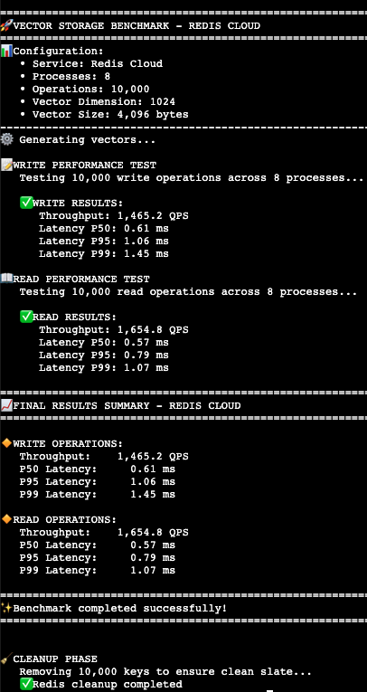
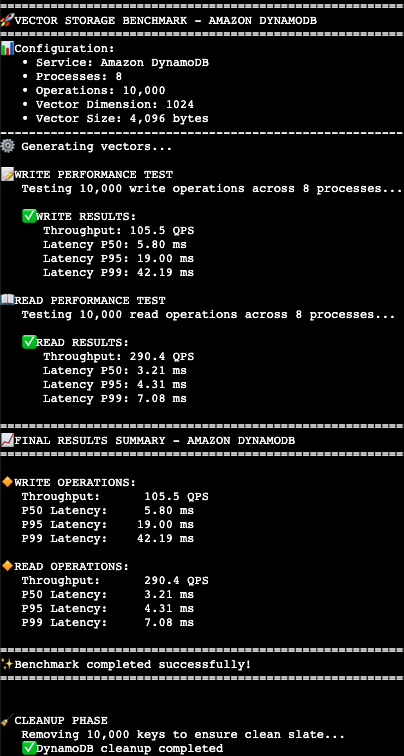

# Redis vs DynamoDB Benchmarking

A performance comparison tool for Redis and DynamoDB, designed to benchmark read and write operations with vector embeddings to help you choose the right database for your use case.

## What We're Benchmarking

This project compares:
- **Redis** - High-performance in-memory data structure store
- **DynamoDB** - AWS managed NoSQL database with automatic scaling

**Benchmark Operations:**
- ✅ **Write Performance** - Insert operations throughput and latency
- ✅ **Read Performance** - Query operations throughput and latency

## Tutorial & Data Modeling Guide

📚 **[Redis Embeddings Data Modeling Tutorial](redis_embeddings_data_modeling.ipynb)** - Interactive Jupyter notebook covering:
- Redis data structures and APIs for vector embeddings
- Best practices for data modeling patterns
- Hands-on examples with real embedding workflows
- Performance optimization techniques

*Recommended reading before running benchmarks to understand the underlying data patterns being tested.*

## Quick Start

### Prerequisites
- **AWS EC2 instance** (Amazon Linux 2023 recommended)
- **Python 3.11+**
- **Redis server** (for Redis benchmarks)
- **AWS credentials** configured (for DynamoDB benchmarks)

### Setup & Installation

1. **System Dependencies** (AWS EC2 - Run Once)
```bash
# Update system and install essential tools
sudo dnf update -y
sudo dnf install -y git curl wget gcc gcc-c++ make libffi-devel openssl-devel python3-pip

# Verify Python 3 is available
python3 --version
```

2. **Python Environment Setup**
```bash
# Clone the repository
git clone https://github.com/redis-applied-ai/dynamo-vs-redis
cd dynamo-vs-redis

# Install uv (fast Python package manager)
python3 -m pip install --upgrade pip pipx --user
export PATH="$HOME/.local/bin:$PATH"
pipx install uv

# Create virtual environment and install dependencies
uv sync
```

3. **Run Benchmarks**
```bash
# Basic Redis benchmark (runs both write and read tests)
uv run python benchmark.py --db redis

# Basic DynamoDB benchmark (runs both write and read tests)
uv run python benchmark.py --db dynamo

# Advanced usage with custom settings
uv run python benchmark.py --db redis --proc 4 --ops 1000
uv run python benchmark.py --db dynamo --proc 16 --ops 5000
```

## Benchmark Results

Here are benchmark results comparing Redis vs DynamoDB performance with default settings (`--ops 10000` on 8 processes):

<table>
<tr>
<td width="50%">

### Redis Cloud Results


</td>
<td width="50%">

### Amazon DynamoDB Results  


</td>
</tr>
</table>

**Key Findings:** With no tuning on either database — besides standard VPC peering for both — these are the out-of-the-box results for simple read/write tasks involving vector embeddings (cast to bytes).

## Configuration

### Environment Variables

**For Redis:**
- `REDIS_HOST` - Redis server hostname (required)
- `REDIS_PASSWORD` - Redis password (required)  
- `REDIS_PORT` - Redis port (default: 6379)

**For DynamoDB:**
- `DDB_TABLE` - DynamoDB table name (required)
- `AWS_REGION` - AWS region (default: us-east-1)

### Command-Line Options

The benchmark script accepts these arguments:

- `--db {redis,dynamo}` - Database to benchmark (required)
- `--proc N` - Number of parallel processes (default: 8)
- `--ops N` - Total number of operations per test (default: 2000)

**Note:** Each benchmark run executes both write and read tests automatically, providing comprehensive performance metrics including QPS, P50, P95, and P99 latencies.

## Project Structure

```
dynamo-vs-redis/
├── benchmark.py                               # Main benchmark script
├── redis_embeddings_data_modeling.ipynb     # Tutorial notebook  
├── pyproject.toml                            # Python dependencies
├── REDIS.png                                 # Redis benchmark results
├── DYNAMODB.png                              # DynamoDB benchmark results
└── README.md                                 # This file
```

## Use Cases

This benchmarking tool is ideal for:
- 🚀 **AI/ML Applications** - Vector similarity search and embedding storage
- 📊 **Performance Testing** - Database selection for high-throughput workloads  
- 🔍 **Cost Analysis** - Comparing operational costs between Redis and DynamoDB
- 🏗️ **Architecture Planning** - Making informed decisions for production deployments 